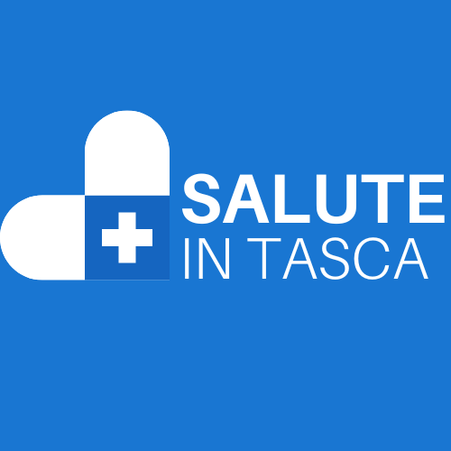

# PROMPT per Creazione GitHub Pages - Salute In Tasca

## Obiettivo
Creare una serie di pagine HTML statiche per GitHub Pages che soddisfino i requisiti di pubblicazione di Apple App Store e Google Play Store per l'app **Salute In Tasca**.

---

## Struttura dei File Richiesti

```
/docs (o root del repository gh-pages)
├── index.html
├── privacy-policy.html
├── terms-of-service.html
├── support.html
├── delete-account.html
├── assets/
│   ├── logo.png (opzionale)
│   └── favicon.ico (opzionale)
└── README.md
```

---

## Specifiche Tecniche Globali

### 1. Framework e Stile
- **NO framework esterni** (Bootstrap, Tailwind, ecc.)
- **CSS inline** o `<style>` nel `<head>` per semplicità
- **Mobile-first responsive design**
- **Accessibilità WCAG 2.1 livello AA**
- **Meta tags per SEO e Open Graph**

### 2. Design System

#### Colori (basati sull'app iOS)
```css
:root {
  --primary-blue: #007AFF;        /* iOS blue */
  --primary-dark: #0051D5;        /* Hover/pressed */
  --surface-light: #F2F2F7;       /* Background iOS */
  --surface-white: #FFFFFF;
  --text-primary: #000000;
  --text-secondary: #8E8E93;
  --success: #34C759;
  --error: #FF3B30;
  --border-light: #C6C6C8;
}
```

#### Tipografia
```css
font-family: -apple-system, BlinkMacSystemFont, 'Segoe UI', Roboto,
             'Helvetica Neue', Arial, sans-serif;
```

#### Breakpoints Responsive
```css
/* Mobile first */
@media (min-width: 640px) { /* Tablet */ }
@media (min-width: 1024px) { /* Desktop */ }
```

### 3. Template HTML Base

```html
<!DOCTYPE html>
<html lang="it">
<head>
    <meta charset="UTF-8">
    <meta name="viewport" content="width=device-width, initial-scale=1.0">
    <meta name="description" content="[DESCRIZIONE PAGINA]">
    <meta name="robots" content="index, follow">

    <!-- Open Graph -->
    <meta property="og:title" content="[TITOLO]">
    <meta property="og:description" content="[DESCRIZIONE]">
    <meta property="og:type" content="website">
    <meta property="og:url" content="[URL]">

    <title>[TITOLO] - Salute In Tasca</title>

    <style>
        /* CSS QUI */
    </style>
</head>
<body>
    <header>
        <nav>
            <!-- Navigation -->
        </nav>
    </header>

    <main>
        <!-- Contenuto principale -->
    </main>

    <footer>
        <!-- Footer con link e copyright -->
    </footer>
</body>
</html>
```

---

## Specifiche per Ogni File

### 1. **index.html** - Homepage

#### Contenuto Richiesto:
- **Hero section** con nome app, tagline e icona
- **Descrizione breve** dell'app (2-3 paragrafi)
- **Funzionalità principali** (elenco puntato con icone)
- **Badge download** App Store e Google Play (con link)
- **Card con link rapidi** a tutte le altre pagine
- **Footer** con copyright e contatti

#### Elementi Chiave:
```html
<section class="hero">
    
    <h1>Salute In Tasca</h1>
    <p class="tagline">La tua cartella medica personale sempre con te</p>
</section>

<section class="features">
    <h2>Funzionalità Principali</h2>
    <ul>
        <li>📅 Gestione appuntamenti medici con promemoria</li>
        <li>💉 Registro vaccinazioni e certificati</li>
        <li>📊 Monitoraggio parametri vitali</li>
        <li>📄 Archiviazione sicura documenti medici</li>
        <li>🔒 Protezione dati con crittografia end-to-end</li>
    </ul>
</section>

<section class="download">
    <h2>Scarica l'App</h2>
    <div class="badges">
        <a href="[APP_STORE_URL]">
            
        </a>
        <a href="[PLAY_STORE_URL]">
            
        </a>
    </div>
</section>
```

---

### 2. **privacy-policy.html** - Privacy Policy

#### Conformità GDPR Richiesta:
- **Identità del Titolare del trattamento**
- **Base giuridica del trattamento** (Art. 6 GDPR)
- **Tipi di dati raccolti**:
  - Dati personali (nome, cognome, data di nascita, CF)
  - Dati sanitari (Art. 9 GDPR - categorie particolari)
  - Dati di utilizzo (analytics, crash reports)
- **Finalità del trattamento**
- **Conservazione dei dati** (tempi e modalità)
- **Diritti dell'utente** (accesso, rettifica, cancellazione, portabilità)
- **Condivisione dati con terze parti** (se presente)
- **Misure di sicurezza** (crittografia, autenticazione)
- **Trasferimenti extra-UE** (se applicabile)
- **Cookie e tecnologie di tracciamento**
- **Modifiche alla policy**
- **Contatti** per esercitare i diritti

#### Struttura:
```html
<main>
    <h1>Privacy Policy</h1>
    <p class="last-updated">Ultimo aggiornamento: [DATA]</p>

    <section id="introduzione">
        <h2>1. Introduzione</h2>
        <p>La presente Privacy Policy descrive...</p>
    </section>

    <section id="titolare">
        <h2>2. Titolare del Trattamento</h2>
        <p>Titolare: [NOME/AZIENDA]</p>
        <p>Email: [EMAIL]</p>
        <p>Indirizzo: [INDIRIZZO]</p>
    </section>

    <section id="dati-raccolti">
        <h2>3. Dati Raccolti</h2>
        <h3>3.1 Dati Personali</h3>
        <ul>
            <li>Nome e cognome</li>
            <li>Data di nascita</li>
            <li>Codice fiscale</li>
        </ul>

        <h3>3.2 Dati Sanitari (Art. 9 GDPR)</h3>
        <p><strong>Attenzione:</strong> I dati sanitari sono categorie particolari...</p>
        <ul>
            <li>Appuntamenti medici</li>
            <li>Referti e esami clinici</li>
            <li>Vaccinazioni</li>
            <li>Parametri vitali</li>
        </ul>
    </section>

    <section id="finalita">
        <h2>4. Finalità del Trattamento</h2>
        <p>I dati vengono trattati per:</p>
        <ul>
            <li>Fornire i servizi dell'app</li>
            <li>Gestire il tuo account</li>
            <li>Inviare notifiche e promemoria</li>
        </ul>
    </section>

    <section id="base-giuridica">
        <h2>5. Base Giuridica (Art. 6 GDPR)</h2>
        <ul>
            <li><strong>Consenso esplicito</strong> (Art. 6.1.a e Art. 9.2.a per dati sanitari)</li>
            <li><strong>Esecuzione contratto</strong> (Art. 6.1.b)</li>
        </ul>
    </section>

    <section id="conservazione">
        <h2>6. Conservazione dei Dati</h2>
        <p>I dati vengono conservati:</p>
        <ul>
            <li>Per tutta la durata dell'utilizzo dell'app</li>
            <li>Fino a richiesta di cancellazione</li>
            <li>Backup: cancellati dopo 30 giorni dalla richiesta</li>
        </ul>
    </section>

    <section id="diritti-utente">
        <h2>7. Diritti dell'Utente (Art. 15-22 GDPR)</h2>
        <p>Hai diritto di:</p>
        <ul>
            <li><strong>Accesso</strong> (Art. 15): ottenere copia dei tuoi dati</li>
            <li><strong>Rettifica</strong> (Art. 16): correggere dati inesatti</li>
            <li><strong>Cancellazione</strong> (Art. 17): eliminare i tuoi dati</li>
            <li><strong>Portabilità</strong> (Art. 20): esportare i dati in formato leggibile</li>
            <li><strong>Opposizione</strong> (Art. 21): opporti al trattamento</li>
            <li><strong>Revoca consenso</strong>: in qualsiasi momento</li>
        </ul>
        <p>Per esercitare i tuoi diritti: <a href="mailto:[EMAIL]">[EMAIL]</a></p>
    </section>

    <section id="sicurezza">
        <h2>8. Misure di Sicurezza</h2>
        <ul>
            <li>Crittografia end-to-end dei dati sanitari</li>
            <li>Autenticazione biometrica (Face ID/Touch ID)</li>
            <li>Dati archiviati localmente sul dispositivo</li>
            <li>Backup crittografati su iCloud/Google Drive</li>
        </ul>
    </section>

    <section id="terze-parti">
        <h2>9. Condivisione con Terze Parti</h2>
        <p>I tuoi dati NON vengono condivisi con terze parti, eccetto:</p>
        <ul>
            <li><strong>Apple/Google</strong>: per backup cloud (su tua richiesta)</li>
            <li><strong>Firebase Analytics</strong>: dati anonimi di utilizzo</li>
        </ul>
    </section>

    <section id="minori">
        <h2>10. Minori</h2>
        <p>L'app può essere utilizzata per gestire dati di minori sotto responsabilità del genitore/tutore.</p>
    </section>

    <section id="modifiche">
        <h2>11. Modifiche alla Privacy Policy</h2>
        <p>Ci riserviamo il diritto di modificare questa policy. Gli utenti verranno informati tramite notifica in-app.</p>
    </section>

    <section id="contatti">
        <h2>12. Contatti</h2>
        <p>Email: <a href="mailto:[EMAIL]">[EMAIL]</a></p>
        <p>Supporto: <a href="support.html">Pagina di supporto</a></p>
    </section>

    <section id="autorita">
        <h2>13. Autorità di Controllo</h2>
        <p>Hai diritto di proporre reclamo al Garante per la Protezione dei Dati Personali:</p>
        <p>
            Garante Privacy<br>
            Piazza Venezia, 11 - 00187 Roma<br>
            Email: garante@gpdp.it<br>
            Sito: <a href="https://www.garanteprivacy.it">www.garanteprivacy.it</a>
        </p>
    </section>
</main>
```

---

### 3. **terms-of-service.html** - Termini di Servizio

#### Contenuto Richiesto:
- **Accettazione dei termini**
- **Descrizione del servizio**
- **Obblighi dell'utente**
- **Limitazioni di responsabilità**
- **Proprietà intellettuale**
- **Modifiche ai termini**
- **Legge applicabile e foro competente**
- **Clausola medica** (l'app non sostituisce il parere medico)

#### Struttura:
```html
<main>
    <h1>Termini e Condizioni di Servizio</h1>
    <p class="last-updated">Ultimo aggiornamento: [DATA]</p>

    <section id="accettazione">
        <h2>1. Accettazione dei Termini</h2>
        <p>Utilizzando l'app "Salute In Tasca", accetti questi termini...</p>
    </section>

    <section id="descrizione">
        <h2>2. Descrizione del Servizio</h2>
        <p>"Salute In Tasca" è un'app per la gestione personale della cartella medica...</p>
    </section>

    <section id="disclaimer-medico">
        <h2>3. ⚠️ Clausola Medica Importante</h2>
        <div class="warning-box">
            <p><strong>ATTENZIONE:</strong> Questa app è uno strumento di organizzazione personale e NON sostituisce:</p>
            <ul>
                <li>La consulenza medica professionale</li>
                <li>La diagnosi medica</li>
                <li>Il trattamento medico</li>
            </ul>
            <p>Consulta sempre un medico qualificato per questioni di salute.</p>
        </div>
    </section>

    <section id="obblighi-utente">
        <h2>4. Obblighi dell'Utente</h2>
        <ul>
            <li>Fornire informazioni accurate</li>
            <li>Mantenere riservate le credenziali di accesso</li>
            <li>Non utilizzare l'app per scopi illeciti</li>
            <li>Non condividere dati sensibili con persone non autorizzate</li>
        </ul>
    </section>

    <section id="limitazioni">
        <h2>5. Limitazioni di Responsabilità</h2>
        <p>L'app è fornita "così com'è". Non garantiamo:</p>
        <ul>
            <li>Disponibilità ininterrotta del servizio</li>
            <li>Assenza di errori o bug</li>
            <li>Compatibilità con tutte le versioni di iOS/Android</li>
        </ul>
    </section>

    <section id="proprieta">
        <h2>6. Proprietà Intellettuale</h2>
        <p>Tutti i contenuti dell'app (testo, grafica, logo) sono proprietà di [NOME].</p>
    </section>

    <section id="modifica-termini">
        <h2>7. Modifiche ai Termini</h2>
        <p>Ci riserviamo il diritto di modificare questi termini. Le modifiche saranno comunicate tramite notifica in-app.</p>
    </section>

    <section id="legge">
        <h2>8. Legge Applicabile</h2>
        <p>Questi termini sono regolati dalla legge italiana. Foro competente: [CITTÀ].</p>
    </section>

    <section id="contatti">
        <h2>9. Contatti</h2>
        <p>Per domande: <a href="mailto:[EMAIL]">[EMAIL]</a></p>
    </section>
</main>
```

---

### 4. **support.html** - Pagina di Supporto

#### Contenuto Richiesto:
- **FAQ** con domande comuni
- **Modulo di contatto** (o email)
- **Link a documentazione**
- **Video tutorial** (se disponibili)
- **Requisiti sistema**

#### Struttura:
```html
<main>
    <h1>Supporto e Assistenza</h1>

    <section id="faq">
        <h2>Domande Frequenti (FAQ)</h2>

        <details>
            <summary>Come posso creare un nuovo appuntamento?</summary>
            <p>Vai nella sezione "Appuntamenti" e tocca il pulsante "+" in alto a destra...</p>
        </details>

        <details>
            <summary>I miei dati sono al sicuro?</summary>
            <p>Sì, tutti i dati sanitari sono crittografati end-to-end...</p>
        </details>

        <details>
            <summary>Come posso esportare i miei documenti?</summary>
            <p>Apri il documento e tocca l'icona di condivisione...</p>
        </details>

        <details>
            <summary>L'app funziona offline?</summary>
            <p>Sì, tutti i dati sono salvati localmente sul tuo dispositivo...</p>
        </details>

        <details>
            <summary>Come posso eliminare il mio account?</summary>
            <p>Vedi le istruzioni dettagliate nella <a href="delete-account.html">pagina dedicata</a>.</p>
        </details>
    </section>

    <section id="requisiti">
        <h2>Requisiti di Sistema</h2>
        <div class="requirements">
            <div class="req-ios">
                <h3>📱 iOS</h3>
                <ul>
                    <li>iOS 14.0 o successivo</li>
                    <li>iPhone 6s o successivo</li>
                    <li>iPad (5ª generazione) o successivo</li>
                </ul>
            </div>
            <div class="req-android">
                <h3>🤖 Android</h3>
                <ul>
                    <li>Android 8.0 (Oreo) o successivo</li>
                    <li>Spazio di archiviazione: 50 MB</li>
                </ul>
            </div>
        </div>
    </section>

    <section id="contatti">
        <h2>Contattaci</h2>
        <p>Non hai trovato la risposta che cercavi?</p>
        <div class="contact-card">
            <p><strong>Email:</strong> <a href="mailto:support@saluteintasca.it">support@saluteintasca.it</a></p>
            <p><strong>Tempo di risposta:</strong> Entro 48 ore lavorative</p>
        </div>
    </section>

    <section id="feedback">
        <h2>Invia Feedback</h2>
        <p>Aiutaci a migliorare l'app! Invia suggerimenti o segnala bug a:</p>
        <p><a href="mailto:feedback@saluteintasca.it">feedback@saluteintasca.it</a></p>
    </section>
</main>
```

---

### 5. **delete-account.html** - Eliminazione Account

#### Contenuto Richiesto:
- **Istruzioni passo-passo** per eliminare l'account
- **Avviso su cosa verrà eliminato**
- **Informazioni su backup e recupero**
- **Tempi di cancellazione**
- **Alternative** (es. disattivazione temporanea)

#### Struttura:
```html
<main>
    <h1>Eliminazione Account e Dati</h1>

    <section id="intro">
        <div class="warning-box">
            <h2>⚠️ Attenzione</h2>
            <p>L'eliminazione dell'account è <strong>permanente e irreversibile</strong>.</p>
        </div>
    </section>

    <section id="cosa-viene-eliminato">
        <h2>Cosa Verrà Eliminato</h2>
        <ul>
            <li>✅ Tutti i tuoi dati personali</li>
            <li>✅ Tutti i documenti medici caricati</li>
            <li>✅ Storico appuntamenti e visite</li>
            <li>✅ Parametri vitali registrati</li>
            <li>✅ Backup cloud (se attivati)</li>
        </ul>
    </section>

    <section id="prima-di-eliminare">
        <h2>Prima di Procedere</h2>
        <p>Ti consigliamo di:</p>
        <ol>
            <li><strong>Esportare i dati</strong>: Vai su Impostazioni → Esporta Dati</li>
            <li><strong>Scaricare i documenti</strong> importanti</li>
            <li><strong>Verificare</strong> di non aver bisogno di referti o certificati</li>
        </ol>
    </section>

    <section id="istruzioni">
        <h2>Come Eliminare l'Account</h2>

        <h3>Metodo 1: Dall'App</h3>
        <ol>
            <li>Apri l'app "Salute In Tasca"</li>
            <li>Vai su <strong>Profilo</strong> → <strong>Impostazioni</strong></li>
            <li>Scorri fino a <strong>"Elimina Account"</strong></li>
            <li>Tocca <strong>"Elimina Account e Dati"</strong></li>
            <li>Conferma con Face ID/Touch ID/Password</li>
            <li>Inserisci la password per conferma finale</li>
            <li>Tocca <strong>"Elimina Definitivamente"</strong></li>
        </ol>

        <h3>Metodo 2: Richiesta via Email</h3>
        <p>Se non puoi accedere all'app, invia una richiesta a:</p>
        <div class="contact-card">
            <p><strong>Email:</strong> <a href="mailto:privacy@saluteintasca.it">privacy@saluteintasca.it</a></p>
            <p><strong>Oggetto:</strong> Richiesta eliminazione account</p>
            <p><strong>Includi:</strong></p>
            <ul>
                <li>Nome e cognome</li>
                <li>Email registrata nell'app</li>
                <li>Data di nascita (per verifica identità)</li>
            </ul>
        </div>
    </section>

    <section id="tempi">
        <h2>Tempi di Cancellazione</h2>
        <ul>
            <li><strong>Dati in-app:</strong> Immediata</li>
            <li><strong>Backup cloud:</strong> Entro 30 giorni</li>
            <li><strong>Log di sistema:</strong> Entro 90 giorni</li>
        </ul>
    </section>

    <section id="alternative">
        <h2>Alternative all'Eliminazione</h2>
        <p>Se non sei sicuro, puoi:</p>
        <ul>
            <li>📤 <strong>Esportare i dati</strong> e conservarli esternamente</li>
            <li>🔒 <strong>Disattivare le notifiche</strong> temporaneamente</li>
            <li>🗑️ <strong>Eliminare solo documenti specifici</strong> invece dell'intero account</li>
        </ul>
    </section>

    <section id="dopo-eliminazione">
        <h2>Dopo l'Eliminazione</h2>
        <p>Una volta completata la cancellazione:</p>
        <ul>
            <li>Riceverai un'email di conferma</li>
            <li>Non potrai recuperare i dati</li>
            <li>Potrai creare un nuovo account in futuro</li>
        </ul>
    </section>

    <section id="contatti">
        <h2>Hai Bisogno di Aiuto?</h2>
        <p>Contattaci: <a href="mailto:support@saluteintasca.it">support@saluteintasca.it</a></p>
    </section>
</main>
```

---

### 6. **README.md** - Documentazione Repository

```markdown
# Salute In Tasca - GitHub Pages

Sito ufficiale con documentazione legale e supporto per l'app **Salute In Tasca**.

## 🔗 Link Utili

- 📱 [App Store](LINK_APP_STORE)
- 🤖 [Google Play Store](LINK_PLAY_STORE)
- 🌐 [Sito Web](https://tuousername.github.io/salute-in-tasca)

## 📄 Pagine Disponibili

- [Homepage](https://tuousername.github.io/salute-in-tasca/)
- [Privacy Policy](https://tuousername.github.io/salute-in-tasca/privacy-policy.html)
- [Termini di Servizio](https://tuousername.github.io/salute-in-tasca/terms-of-service.html)
- [Supporto](https://tuousername.github.io/salute-in-tasca/support.html)
- [Eliminazione Account](https://tuousername.github.io/salute-in-tasca/delete-account.html)

## 🛠️ Tecnologie

- HTML5 puro
- CSS3 inline/embedded
- Responsive mobile-first
- Accessibilità WCAG 2.1 AA

## 📋 Conformità

- ✅ GDPR (Regolamento UE 2016/679)
- ✅ Apple App Store Guidelines
- ✅ Google Play Store Policies
- ✅ Codice Privacy Italiano (D.Lgs. 196/2003)

## 📝 Licenza

© 2025 [TUO NOME/AZIENDA]. Tutti i diritti riservati.

## 📧 Contatti

- **Email:** privacy@saluteintasca.it
- **Supporto:** support@saluteintasca.it
```

---

## Componenti CSS Riutilizzabili

### Navigation Bar
```css
nav {
    background: var(--primary-blue);
    padding: 1rem;
    position: sticky;
    top: 0;
    z-index: 100;
}

nav ul {
    list-style: none;
    display: flex;
    gap: 1.5rem;
    flex-wrap: wrap;
}

nav a {
    color: white;
    text-decoration: none;
    font-weight: 500;
}

nav a:hover {
    text-decoration: underline;
}
```

### Footer
```css
footer {
    background: var(--surface-light);
    padding: 2rem 1rem;
    margin-top: 4rem;
    text-align: center;
    border-top: 1px solid var(--border-light);
}

footer p {
    margin: 0.5rem 0;
    color: var(--text-secondary);
    font-size: 0.9rem;
}
```

### Warning Box
```css
.warning-box {
    background: #FFF3CD;
    border-left: 4px solid #FFC107;
    padding: 1rem;
    margin: 1rem 0;
    border-radius: 4px;
}

.warning-box strong {
    color: #856404;
}
```

### Card Component
```css
.card {
    background: white;
    border-radius: 12px;
    padding: 1.5rem;
    box-shadow: 0 2px 8px rgba(0,0,0,0.1);
    margin: 1rem 0;
}
```

### Button Styles
```css
.btn-primary {
    background: var(--primary-blue);
    color: white;
    padding: 0.75rem 1.5rem;
    border: none;
    border-radius: 8px;
    font-size: 1rem;
    cursor: pointer;
    text-decoration: none;
    display: inline-block;
    transition: background 0.2s;
}

.btn-primary:hover {
    background: var(--primary-dark);
}
```

### Details/Accordion (FAQ)
```css
details {
    background: white;
    border: 1px solid var(--border-light);
    border-radius: 8px;
    padding: 1rem;
    margin: 0.5rem 0;
}

summary {
    cursor: pointer;
    font-weight: 600;
    user-select: none;
}

summary:hover {
    color: var(--primary-blue);
}

details[open] summary {
    margin-bottom: 0.5rem;
    color: var(--primary-blue);
}
```

---

## Accessibilità (WCAG 2.1 AA)

### Checklist:
- ✅ **Contrasto colori** minimo 4.5:1 per testo normale
- ✅ **Focus visibile** su tutti gli elementi interattivi
- ✅ **Attributi ARIA** dove necessario
- ✅ **Alt text** per tutte le immagini
- ✅ **Heading hierarchy** corretta (h1 → h2 → h3)
- ✅ **Link descrittivi** (no "clicca qui")
- ✅ **Form labels** associati agli input

### Esempio Focus:
```css
a:focus, button:focus, details:focus {
    outline: 2px solid var(--primary-blue);
    outline-offset: 2px;
}
```

---

## SEO Best Practices

### Meta Tags Essenziali:
```html
<meta name="description" content="Descrizione max 160 caratteri">
<meta name="keywords" content="salute, cartella medica, app sanitaria">
<meta name="author" content="[TUO NOME]">
<link rel="canonical" href="[URL_CANONICO]">
```

### Open Graph:
```html
<meta property="og:title" content="Salute In Tasca - Privacy Policy">
<meta property="og:description" content="Privacy policy conforme GDPR">
<meta property="og:image" content="[URL_IMMAGINE]">
<meta property="og:url" content="[URL_PAGINA]">
<meta property="og:type" content="website">
```

---

## Deployment su GitHub Pages

### Step 1: Configurazione Repository
1. Crea repository `salute-in-tasca` (o nome a scelta)
2. Vai su **Settings** → **Pages**
3. Seleziona branch `main` e folder `/docs` (o `/root`)
4. Salva

### Step 2: Struttura File
```
/docs
├── index.html
├── privacy-policy.html
├── terms-of-service.html
├── support.html
├── delete-account.html
├── assets/
│   ├── logo.png
│   └── favicon.ico
└── README.md
```

### Step 3: URL Finale
Il sito sarà disponibile su:
```
https://tuousername.github.io/salute-in-tasca/
```

---

## Validazione e Testing

### Checklist Pre-Pubblicazione:
- [ ] HTML valido (usa [W3C Validator](https://validator.w3.org/))
- [ ] CSS valido
- [ ] Test responsive (mobile, tablet, desktop)
- [ ] Test accessibilità ([WAVE](https://wave.webaim.org/))
- [ ] Test velocità ([PageSpeed Insights](https://pagespeed.web.dev/))
- [ ] Link funzionanti (tutti i link interni/esterni)
- [ ] Email funzionanti (mailto: link)
- [ ] Data ultimo aggiornamento corretta

### Browser da Testare:
- ✅ Safari (iOS/macOS)
- ✅ Chrome (Android/Windows/macOS)
- ✅ Firefox
- ✅ Edge

---

## Informazioni da Sostituire

Prima della pubblicazione, sostituisci questi placeholder:

- `[NOME/AZIENDA]` → Nome del titolare del trattamento
- `[EMAIL]` → Email di contatto (es. privacy@saluteintasca.it)
- `[INDIRIZZO]` → Indirizzo fisico dell'azienda/sviluppatore
- `[DATA]` → Data ultimo aggiornamento (es. 1 gennaio 2025)
- `[CITTÀ]` → Foro competente (es. Milano)
- `[APP_STORE_URL]` → Link all'app su App Store
- `[PLAY_STORE_URL]` → Link all'app su Google Play Store
- `[URL]` → URL del sito GitHub Pages

---

## Link di Riferimento

### GDPR e Privacy:
- [Testo GDPR ufficiale](https://eur-lex.europa.eu/eli/reg/2016/679/oj)
- [Garante Privacy Italia](https://www.garanteprivacy.it/)
- [Linee guida app sanitarie](https://www.garanteprivacy.it/temi/sanita)

### App Store Guidelines:
- [Apple Developer Guidelines](https://developer.apple.com/app-store/review/guidelines/)
- [Google Play Policies](https://play.google.com/about/developer-content-policy/)

### Accessibilità:
- [WCAG 2.1 Guidelines](https://www.w3.org/WAI/WCAG21/quickref/)
- [WebAIM Resources](https://webaim.org/)

---

## Note Finali

- **Linguaggio:** Tutto in italiano (mercato primario)
- **Tono:** Professionale ma accessibile
- **Lunghezza:** Privacy Policy ~2000-3000 parole
- **Aggiornamenti:** Rivedi almeno annualmente
- **Backup:** Mantieni versioni precedenti con date

---

## Supporto

Per domande su questo prompt o sui requisiti legali:
- Consulta un **avvocato specializzato in privacy e GDPR**
- Verifica con il **Garante Privacy** per casi specifici
- Contatta **Apple/Google Developer Support** per requisiti store

---

**Data creazione prompt:** Novembre 2025
**Versione:** 1.0
**Compatibile con:** iOS 14+, Android 8+, GitHub Pages
